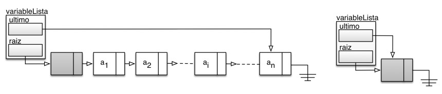
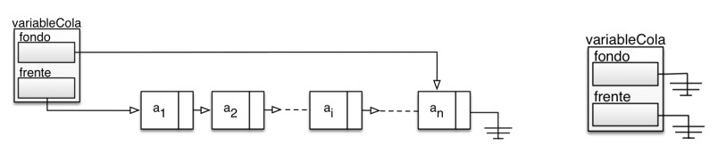

# Enunciado del ejercicio a entregar

## Enunciado 1

### TAD LISTA

Se define el TAD lista como una secuencia ordenada de cero o más elementos de un determinado tipo de dato `a1, a2, a3, ..., an`. El orden de los elementos está determinado por su posición en la secuencia, el elemento `ai` está en la posición `i`.

Se debe implementar en C el TAD **lista**, utilizando para ello listas simplemente enlazadas y con nodo ficticio.

Para mejorar la eficiencia de algunas funciones se define el tipo de dato, que llamaremos *Lista*, utilizando un registro (*struct*) con dos campos, siendo el primer campo un puntero al nodo ficticio (campo *raiz* del registro) y el segundo campo un puntero que apuntará al último nodo de la lista enlazada (campo *ultimo* del registro).

En la Figura 1 se puede observar el registro y la lista enlazada que representa el tipo *Lista* conteniendo valores y una lista vacía, lo que implica que la lista enlazada sólo contiene el nodo ficticio, con los dos punteros apuntando a dicho nodo ficticio, y el campo *sig* de dicho nodo ficticio puesto a *NULL*.

Figura 1: Lista implementada mediante una lista simplemente enlazada con nodo ficticio.

Además se utilizará la definición de **posición** que se describe en clase de teoría: la posición del elemento *ai* en la lista es el puntero al nodo que contiene, en su campo *sig*, la dirección o puntero al nodo que almacena el elemento `ai`, es decir:

- La posición del elemento `ai` será el puntero al nodo que contiene `ai-1` para `i = 2, 3, 4, ..., n`.
- La posición de `a1` será el puntero al nodo cabecera o nodo ficticio.
- La posición *fin(l)* es el puntero al último nodo de la lista enlazada, es decir, el nodo que contiene el elemento `an`. Importante, la posición del elemento `an` es un puntero al nodo que contiene `an-1`, por lo tanto, la posición *fin(l)* no corresponde a elemento alguno de la lista, de forma análoga a como sucede con la implementación mediante matrices.
- Si la lista está vacía *fin(l)* devolverá la dirección del nodo ficticio.

A continuación se describen las funciones que se entregan ya implementadas:

- `int creaVacia(Lista *l)`: Esta función recibe, por referencia, una variable del tipo *Lista* y la inicializa, y la deja preparada para comenzar a usarla. Esta función será la que se invoque **antes** de poder utilizar la lista para almacenar valores.
- `int vacia(Lista *l)`: Devuelve un verdadero o falso, dependiendo de si la lista, *l*, está vacía o no. En caso de estar mal inicializada devuelve un -1.
- `int destruye(Lista *l)`: Libera el nodo ficticio de una lista vacía y pone los dos punteros de la estructura a *NULL*. Se debe utilizar **siempre** después de haber invocado *anula()*. Devuelve un cero en caso de éxito, y un entero negativo en caso de que la lista no esté vacía u otros errores.
- `void imprime(Lista *l)`: Recorre la lista mostrando los valores por pantalla, junto con un índice entero que indica la posición del valor en dicha lista. No devuelve valor alguno. Si la lista está mal construida o está vacía no mostrará nada por pantalla.
- `tipoPosicion anterior(tipoPosicion p,Lista *l)` Esta función devolverá la posición del elemento, en la lista *l*, anterior a la posición representada por el parámetro *p*. Si dicho parámetro *p* es la primera posición de la lista, entonces la función devuelve la misma posición que la función *primero(l)*, es decir, la dirección del nodo ficticio.

A continuación se describen las funciones que debe implementar el alumno:

- `tipoPosicion primero(Lista *l)` Esta función devuelve la posición del primer elemento de la lista, es decir, la dirección del nodo ficticio, siguiendo la definición de *posición* que se está utilizando. El alumno será responsable de garantizar el comportamiento correcto de esta función en el caso de que no exista nodo ficticio (porque la lista no ha sido correctamente inicializada). En caso de que la lista esté vacía, el comportamiento sigue siendo el mismo.

- `tipoPosicion fin(Lista *l)` Devuelve la posición siguiente al último elemento de la lista, según se indica en la definición de posición. El alumno es responsable de establecer el comportamiento cuando la referencia a la lista no es válida, o si no está correctamente inicializada.

- `int inserta(tipoElemento x, tipoPosicion p, Lista *l)` Inserta el elemento x en la posición p de la lista l, pasando los elementos de la posición p y siguientes a la posición inmediata posterior:
  Si *l* es `a1, a2, ... , ap-1, ap, ap+1, ..., an` pasa a ser `a1, a2, ..., ap-1, x, ap, ap+1, ..., an`
  Si *p* es *fin(l)* entonces x se añade al final de la lista pasando a ser el último elemento de la misma.
  El alumno es responsable de establecer el comportamiento cuando las referencias a la lista o a la posición p no son válidas (puntero *NULL*).

- `int suprime (tipoPosicion p, Lista *l)`: Esta función eliminará el elemento de la lista indicado por la posición p en la lista l, pasando los elementos de la posición p + 1 y siguientes a la posición inmediata anterior:
  Si l es `a1, a2, ... , ap-1, ap, ap+1, ..., an` pasa a ser `a1, a2, ..., ap-1, ap+1, ..., an`
  El alumno es responsable de establecer el comportamiento cuando las referencias a la lista o a la posición p no son válidas.

- `tipoPosicion siguiente(tipoPosicion p,Lista *l)`: Esta función devolverá la posición siguiente a la representada por el parámetro *p* en la lista *l*. Si la posición referenciada por el parámetro *p* es *fin(l)*, entonces esta función devolverá *fin(l)*. El alumno es responsable de establecer el comportamiento cuando las referencias a la lista o a la posición *p* no son válidas (puntero *NULL*).

- `tipoPosicion localiza (tipoElemento x, Lista *l)`: Devuelve la posición del elemento *x* en la lista *l*. Si aparece más de una vez devuelve la posición de la primera aparición, y si no aparece, devuelve *fin(l)*.

- `tipoElemento recupera(tipoPosicion p, Lista *l)`: Devuelve el elemento que está en la posición *p* de la lista *l*. El alumno es responsable de establecer el comportamiento cuando las referencias a la lista o a la posición *p* no son válidas, o cuando *p* es *fin(l)*.

- `int anula(Lista *l)` Vacía la lista de elementos y la prepara para seguir en uso. Se libera la memoria reservada para todos los nodos que contienen los elementos de la lista `(a1, a2, ..., an)`, dejando únicamente el nodo ficticio. Devuelve un cero en caso de éxito, y un entero negativo en caso de que la lista no sea válida.

- `int concatena(Lista *la, Lista *lb)` Concatena las dos listas que recibe como argumento. La  operación se realizará colocando los elementos de la lista referenciada por el parámetro `lb` a  continuación el último elemento de la lista referenciada por parámetro `la`. Si `la` es la colección de elementos `a1, a2, ..., an` y `lb` es la colección `b1, b2, ..., bn`, el resultado de la ejecución de esta función es el siguiente:

  - La lista `la` debe contener los elementos `a1; a2; : : : ; an; b1; b2; : : : ; bn`.
  - La lista `lb` debe quedar vacía.

  La función devolverá un cero en caso de éxito, y un entero negativo en caso de que alguna de las dos listas no sea válida.

  

## Enunciado 2

### TAD PILA

Tipo especial de lista con la restricción de que las inserciones y eliminaciones solo pueden realizarse en una posición, denominada tope o cima de la pila. Se trata de una lista de tipo LIFO (Last In, First Out), en la
que existe un elemento (siempre que no este vacía) en la cima de la pila que es el único visible o accesible. A continuación se definen las operaciones básicas que típicamente incluye un TAD pila:

- `creaVacía(p)`: inicia o crea la pila *p* como una pila vacía, sin ningún elemento.
- `vacía(p)`: devuelve verdadero si la pila *p* está vacía, y falso en caso contrario.
- `inserta(x,p)`: añade el elemento *x* a la pila *p* convirtiéndolo en el nuevo tope o cima de la pila.
- `suprime(p)`: devuelve y suprime el elemento del tope o cima de la pila.

Realizar la implementación del TAD Pila descrito previamente utilizando listas simplemente enlazadas **sin** nodo ficticio, según muestra la siguiente Figura 2:

Figura 2: Pila implementada mediante lista simplemente enlazada sin nodo ficticio.

Como se puede apreciar en Figura 2, la variable `variablePila` es un puntero de tipo `tipoCelda` que apunta al nodo que contiene el último elemento (tope o cima) insertado en la pila. Una pila vacía es dicha variable a *NULL* (ver Figura 2).
La implementación debe hacerse ajustándose a los tipos y prototipos que se adjuntan en el fichero cabecera `pila.h` que se encuentra en la carpeta `pilas` que se entrega junto con este enunciado.

## Enunciado 3

### TAD COLA

Tipo especial de lista con la restricción de que las inserciones se realizan por un extremo de la lista denominado fondo y las eliminaciones por el otro extremo, denominado frente. Se trata de una lista de tipo FIFO (*First In, First Out*), en las que el primer elemento que entra es el primero en salir. A continuación se definen las operaciones básicas que típicamente incluye un TAD cola:

- `creaVacía(c)`: inicia o crea la cola c como una cola vacía, sin ningún elemento.
- `vacía(c)`: devuelve verdadero si la cola c está vacía, y falso en caso contrario.
- `inserta(x, c)`: añade el elemento x a la cola c convirtiéndolo en el último elemento de la cola. Se añade por el fondo o final de la cola.
- `suprime(c)`: devuelve y suprime el primer elemento de la cola, de forma que el siguiente elemento pasa a ser el nuevo frente.

Realizar la implementación del TAD Cola descrito previamente utilizando listas simplemente enlazadas sin nodo ficticio, según muestra la siguiente Figura 3:

Figura 3: Cola implementada mediante lista simplemente enlazada sin nodo ficticio.

Como se puede apreciar en Figura 3, la variable `variableCola` es una estructura con dos punteros de tipo `tipoCelda`:

- el puntero frente que apunta siempre al primer nodo de la lista enlazada, por donde se extraen los elementos.
- el puntero fondo que apunta siempre al último nodo de la lista enlazada, por donde se añaden los nuevos elementos.

En el caso de estar vacía la cola, ambos punteros estarán a *NULL* (ver Figura 3). La implementación debe hacerse ajustándose a los tipos y prototipos que se adjuntan en el fichero cabecera `cola.h` que se  encuentra en la carpeta colas que se entrega junto con este enunciado.

## Consideraciones generales sobre la implementación

El alumno es responsable de crear programas con los que poder probar la correcta implementación de las funciones que se piden. Para ello se puede apoyar en los ejercicios propuestos durante las sesiones de prácticas de este tema.

La gestión de errores es responsabilidad del estudiante. Los prototipos de las funciones están preparados para devolver un valor entero que indique un código de error, o bien un 0 en caso de éxito. **Importante**: Las funciones a implementar no mostrarán ningún mensaje por pantalla, en ningún caso.

El fichero entregaTAD.zip que se entrega contiene la siguiente estructura de carpetas:

- *listas*, carpeta que contiene el ficheros de cabecera `lista.h`, con las definiciones de tipos y prototipos  de funciones, y el fichero `lista.c` con el código que debe completar el estudiante. En este ejercicio en particular, y para facilitar la correcta realización de pruebas, se entregan algunas funciones ya implementadas.
- *pilas*, carpeta que contiene el ficheros de cabecera `pila.h`, con las definiciones de tipos y prototipos de funciones, y el fichero `pila.c` con el código que debe completar el estudiante.
- *colas*, carpeta que contiene el ficheros de cabecera `cola.h`, con las definiciones de tipos y prototipos de funciones, y el fichero `cola.c` con el código que debe completar el estudiante.